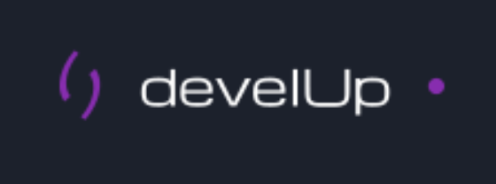

# Final Project

This project extended for a two weeks time period and concluded our time as Students at [Craft Academy](https://craftacademy.se). We built develUp using [Expo](https://expo.io), [React Native](https://reactnative.dev) and Ruby on Rails for the backend.

The API that supports this client can be found in [this Repo](https://github.com/emiliano-ma/develUp_api)



## develUp

develUp was born with the simple idea of providing a platform that connects freelance developers with companies in a trustworthy and score based environment

How do we achieve our goal?

The idea is as follows: companies (clients), will publish a task that they need to perform. On the other side, the 'develUpers' will be able to see the tasks and apply to them if they are interested.

The companies, in turn, will be able to see in each of the tasks they have published, the number of developers who have applied and choose one of them.

And this is where the most important part of the application comes in: our system of scores and levels.

Each task that companies publish will have a number of points that will be the result of two parameters: the chosen programming languages and the estimated timeframe for the project.
The more skills needed and the longer the estimated time, the higher the score.

This amount of points will be obtained by the chosen develUper, once the task is delivered and the client is satisfied.

What will happen next with these points?

DevelUpers will be able to scale levels based on the amount of points they have, and by doing so, we want to obtain a system where the levels of the develUpers represent their skills. Companies can trust in them and in our system.

##### Setup

... get [Yarn](https://yarnpkg.com/)

```
yarn install
```

... You would need to install an [iOS](https://developer.apple.com/library/archive/documentation/IDEs/Conceptual/iOS_Simulator_Guide/GettingStartedwithiOSSimulator/GettingStartedwithiOSSimulator.html) or [Android](https://developer.android.com/studio/run/emulator) simulator.


### e2e tests done with 

- [Detox](https://github.com/wix/Detox)

### Mocking API

 - We use `mockserver` to mock the server responses.

##### Usage

in CLI

```
$  mockserver -p 3000 -m './e2e/mocks'
```

in test configuration: the mockServer is located in `e2e/mockServer.js`

```js
// start server
let server = mockServer.open(<port number>)
```

```js
// close server
mockServer.close(server);
```

### Authors

- [Mauro Avellaneda](https://github.com/mauroavellaneda)
- [Sara Lundkvist](https://github.com/Saralundkvist86/)
- [Emiliano Mainero](https://github.com/emiliano-ma)
- [Facundo Osores](https://github.com/FacundoOs)

### Acknowledgements

- Our co-students for their support.
- [Craft Academy](https://craftacademy.se) for the support
- [Thomas Ochman](https://github.com/tochman) for helping with Detox and webmock setup.


### License

We operate under the [MIT License](https://en.wikipedia.org/wiki/MIT_License).
